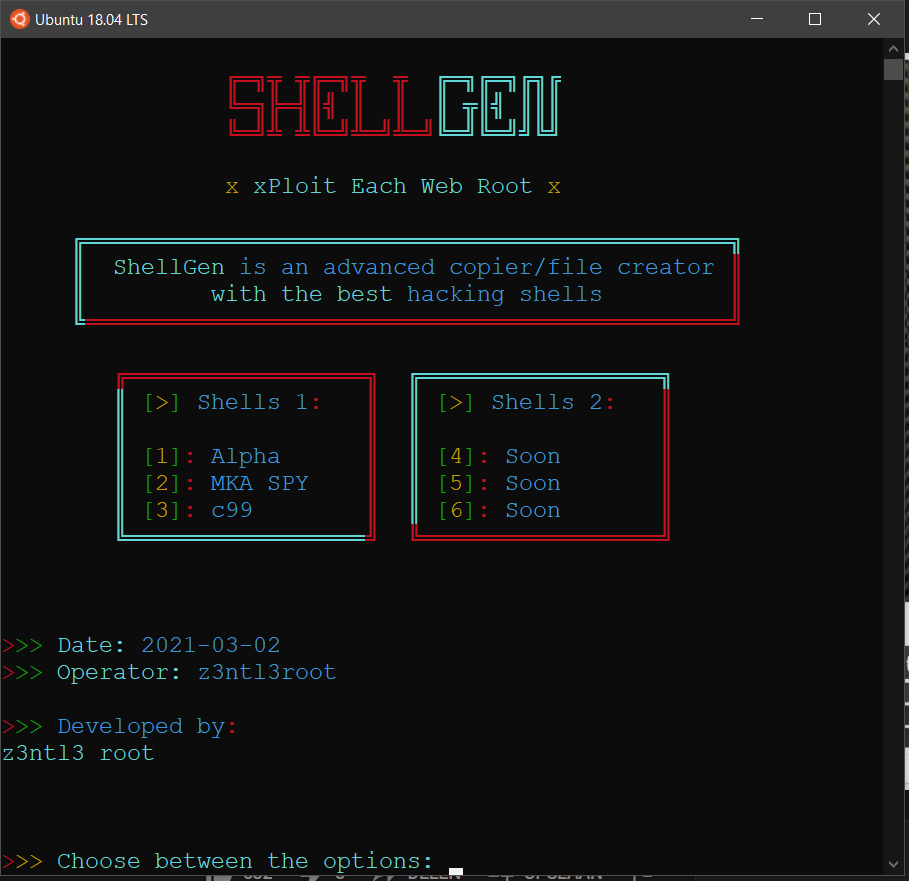

# ShellGen
  
Generates one of the best hacker shells. You could save it fastly as an .php file or just copy it. By this you could upload it fastly to the target website in an easy & fast & ligtweight way.

# Modules
Modules which u need to have on Python3: 
<code>colorama</code> 
<code>pyperclip</code> 
<code>pyarmor</code>  
Install them by <code>pip3 packagename</code> or by <code>pip3 install -r requirements.txt</code>  
Install python3 by: <code>sudo apt install python3</code> + <code>sudo apt install python3-pip</code>
